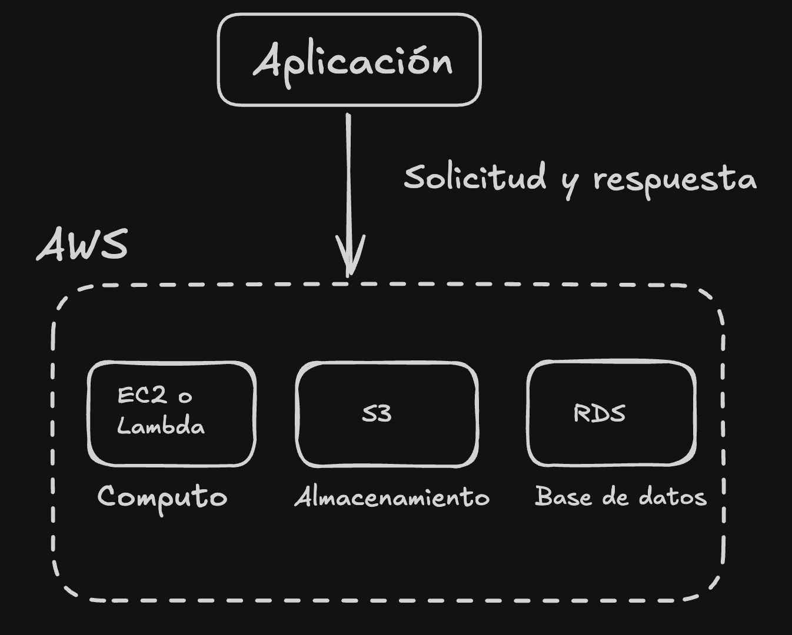

Antes de hablar de AWS es muy importante que estendamos ¿Que es la Nube? ¿Porque surgió?

### ¿Qué es la computación en la nube?

Antes de la nube, muchas empresas ejecutaban sus aplicaciones en servidores propios. Este modelo, conocido como **on-premises**, obligaba a las organizaciones a comprar, instalar y mantener toda su infraestructura.

La **computación en la nube** permite acceder bajo demanda a recursos tecnológicos como servidores, almacenamiento, bases de datos y redes a través de internet.

En lugar de comprar la infraestructura física, las empresas utilizan los recursos de un proveedor y generalmente pagan según su consumo. Esto les permite concentrarse más en sus productos y objetivos de negocio.

### ¿Qué es AWS?

**Amazon Web Services (AWS)** es la plataforma de computación en la nube de Amazon y una de las más utilizadas del mundo.

AWS ofrece [más de 200 servicios](https://docs.aws.amazon.com/whitepapers/latest/aws-overview/introduction.html) en categorías como:

- Computación.
- Almacenamiento.
- Bases de datos.
- Redes.
- Seguridad.
- Análisis de datos.
- Inteligencia artificial y machine learning.

Algunos servicios conocidos son **Amazon EC2** para servidores virtuales, **Amazon S3** para almacenamiento, **Amazon RDS** para bases de datos y **AWS Lambda** para ejecutar código sin administrar servidores.

### Características principales de AWS

- **Pago por uso:** generalmente pagas por los recursos que consumes.
- **Escalabilidad:** permite aumentar o reducir la capacidad de una aplicación.
- **Elasticidad:** los recursos pueden ajustarse dinámicamente según la demanda.
- **Infraestructura global:** cuenta con Regiones y Zonas de disponibilidad distribuidas alrededor del mundo.
- **Servicios administrados:** AWS puede encargarse de parte del mantenimiento, las actualizaciones y el escalamiento.
- **Seguridad:** AWS protege la infraestructura de la nube, mientras que el cliente debe proteger sus datos, permisos y configuraciones.
- **AWS Free Tier:** ofrece créditos y algunos servicios gratuitos para comenzar, sujetos a límites y condiciones.

> **Importante:** AWS proporciona las herramientas para construir aplicaciones escalables, seguras y altamente disponibles, pero estas características no son automáticas. Dependen de cómo se diseñen y configuren los recursos.

### En resumen

AWS permite utilizar recursos tecnológicos bajo demanda sin comprar ni administrar toda la infraestructura física. Sus principales ventajas son la flexibilidad, la rapidez, la escalabilidad y el pago basado en el consumo.

### Referencias

- https://aws.amazon.com/es/what-is-aws/
- https://www.youtube.com/watch?v=zQyrhjEAqLs
