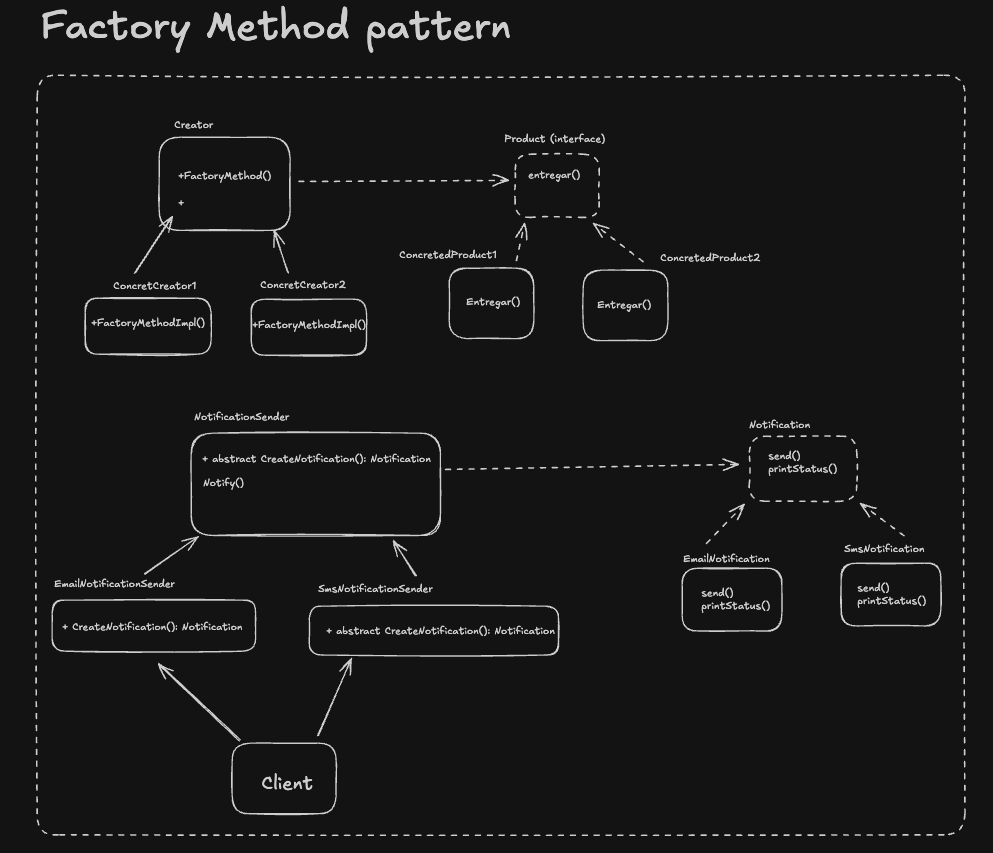

### 1. ¿Qué es el Factory Method?

Es un patrón de diseño **creacional** que define una interfaz para crear un objeto, pero deja que sean las subclases las que decidan qué clase instanciar.

> **La Idea Central:** Imagina una fábrica real. El jefe (tu código) dice "Necesito un vehículo para entregar esto". No le importa si la fábrica produce un camión, un barco o una bicicleta. Solo quiere algo que "transporte". La fábrica decide qué vehículo crear según la logística.

#### El Problema: El acoplamiento rígido

Sin este patrón, tu código estaría lleno de la palabra clave `new`.

```ts
// Código frágil
let transporte;
if (tipo === "tierra") {
  transporte = new Camion(); // ¡Acoplamiento fuerte a la clase Camion!
} else if (tipo === "mar") {
  transporte = new Barco(); // ¡Acoplamiento fuerte a la clase Barco!
}
```

Si mañana inventas el `Avion`, tienes que ir a modificar ese `if/else`. Si tienes ese `if` en 20 archivos, tienes un problema grave.

### 2. Estructura del Patrón



Tiene 4 componentes clave:

1. **Product (Interfaz):** Define qué pueden hacer los objetos que la fábrica crea (ej. `Transporte` -> `entregar()`).
2. **ConcreteProduct:** Las implementaciones reales (ej. `Camion`, `Barco`).
3. **Creator (Clase Abstracta):** Declara el método fábrica. A menudo tiene lógica de negocio que usa el producto.
4. **ConcreteCreator:** Sobrescribe el método fábrica para devolver un producto específico (ej. `LogisticaTerrestre` crea `Camion`).

### 3. Ventajas y Desventajas

| **Ventajas (Pros)**                                                                                                          | **Desventajas (Contras)**                                                                                                                     |
| ---------------------------------------------------------------------------------------------------------------------------- | --------------------------------------------------------------------------------------------------------------------------------------------- |
| **Desacoplamiento:** El código cliente no depende de clases concretas (`NotificadorEmail`), solo de interfaces.              | **Complejidad:** El código se hace más largo. Para agregar un producto nuevo, necesitas crear la clase del producto Y la clase de su fábrica. |
| **Principio Open/Closed:** Puedes añadir nuevos tipos de notificaciones (`PushNotification`) sin romper el código existente. | **Subclases forzadas:** Te obliga a crear subclases del Creator solo para instanciar objetos.                                                 |
| **Principio de Responsabilidad Única:** Mueves el código de creación a un lugar específico, limpiando el resto del código.   |                                                                                                                                               |

### 4. ¿Cuándo usarlo?

1. Cuando no sabes de antemano las clases exactas de los objetos que tu código necesitará.
2. Cuando quieres que tus usuarios (otros programadores) puedan extender tu librería con sus propias clases internas.
3. Cuando quieres ahorrar recursos reutilizando objetos en lugar de recrearlos (similar a un Pool de conexiones), el Factory Method puede encapsular esa lógica.

### Referencias

- https://refactoring.guru/es/design-patterns/factory-method
- https://www.youtube.com/watch?v=lLvYAzXO7Ek
